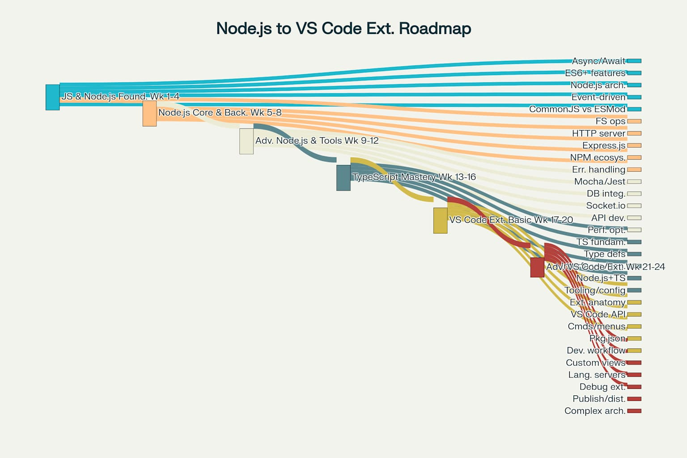

# node

# play

    cd anodeapp # && npm init

dependencies

    npm run test 
    npm run build
    npm run test build

https://www.youtube.com/watch?v=P1qWARtquFg&list=PLlrxD0HtieHje-_287YJKhY8tDeSItwtg&index=8

# now

## Microsoft beginner series

The Microsoft-sponsored beginner series provides 26 practical videos covering Node.js fundamentals in bite-sized segments.

[youtube](https://www.youtube.com/playlist?list=PLlrxD0HtieHje-_287YJKhY8tDeSItwtg)

# Next

## hands-on

Start with hands-on exercises using simple Node.js scripts. Create basic calculator applications, file readers, and simple HTTP servers to understand the core concepts. 

# perplexity

[space](https://www.perplexity.ai/collections/node-ZkusuXbcTVmhd7geVdHNOw)

[roadmap thread](https://www.perplexity.ai/search/i-am-a-senior-software-enginee-0jVo0up6Q9aH50pnxLk6Og)

